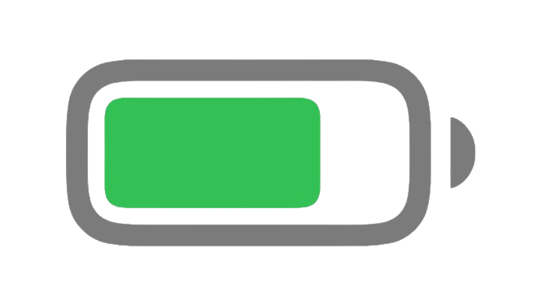

  
  

<h1 align=center>Charge UI</h1>

 
<b>Charge UI</b> es una herramienta de mejoras estéticas 
Este proyecto fue creado por <a href="https://instagram.com/salinxlg">Alejandro Salinas</a>. 
<b>Charge UI es compatible con Windows, Linux y MacOs</b>

 

  

  
Versión de Node.js

  
   
  
  Use Node.js ` v24.6.0 `

  
Versión de npm

  
   
  
  Use npm ` v11.5.1 `

  
Versión de electron

  
   
  
  Use electron ` v31.0.0 `

 

## Información final del proyecto:

- [Alejandro Salinas](https://instagram.com/salinxlg) es el creador de este proyecto
- La versión actual de Charge UI es `v1.0.0`
- © 2025 Alejandro Salinas, Dexly Studios, Todos los derechos Reservados.

  

